# QueuePilot

A unified, open-source management UI for **RabbitMQ**, **Apache Kafka**, and **BullMQ**.

QueuePilot replaces the outdated RabbitMQ management plugin, fills the gap left by Kafka's missing open-source UI, and provides a production-grade alternative to Bull Board -- all in a single, modern application.

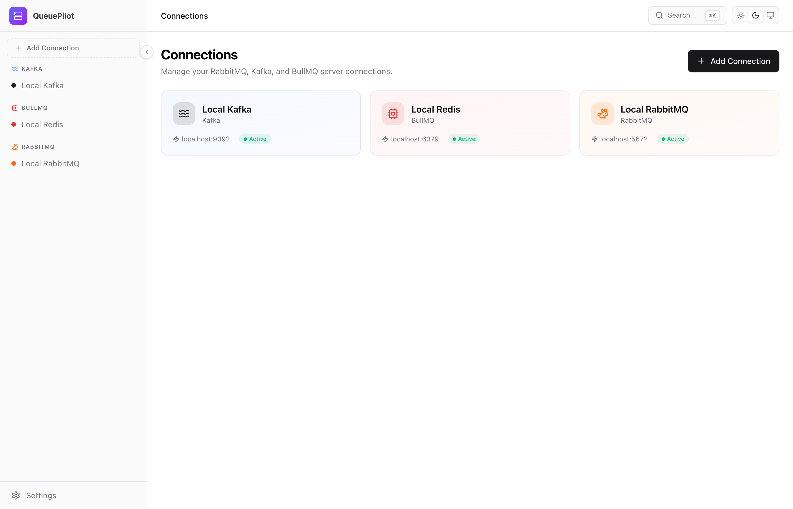

## Why QueuePilot?

- **RabbitMQ's management UI** hasn't been redesigned in over a decade
- **Kafka's open-source edition** ships with no frontend at all -- premium UIs like Confluent Control Center cost thousands per year
- **BullMQ's Bull Board** covers only the basics -- no flow visualization, no advanced job inspection
- **No unified tool** exists to manage all three from one place

QueuePilot gives you a single pane of glass for all your message queues with a modern, beautiful interface that developers actually enjoy using.

## Screenshots

### RabbitMQ Dashboard
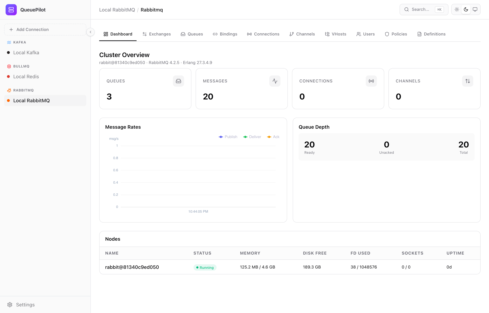

### RabbitMQ Queues
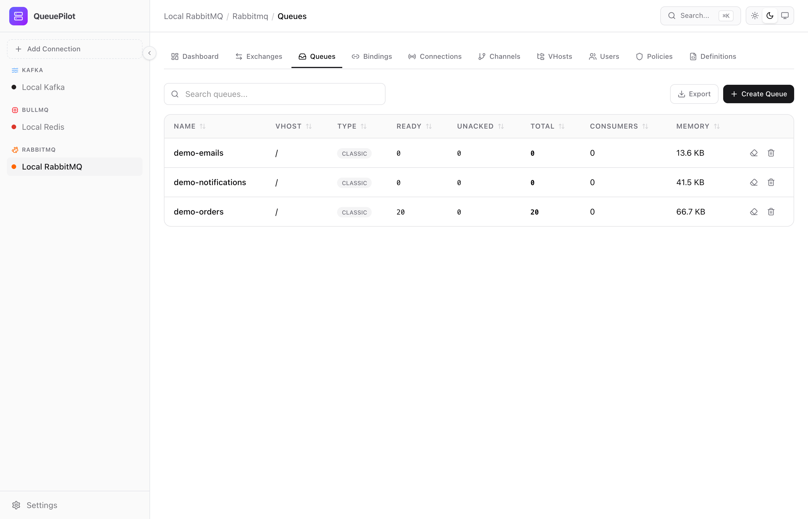

### RabbitMQ Queue Detail -- Message Browser
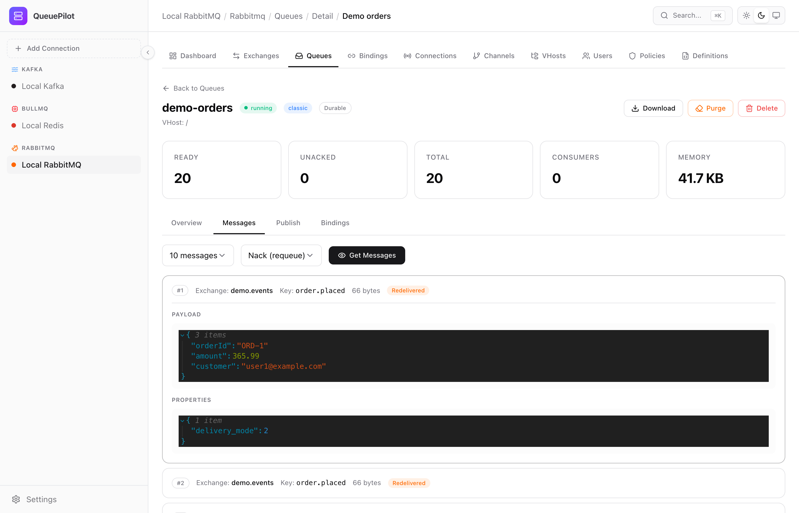

### RabbitMQ Queue Detail -- Publish with JSON Editor
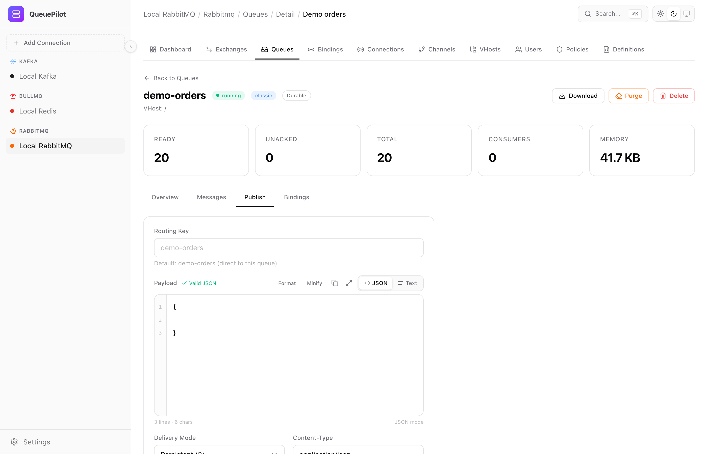

### Kafka Dashboard
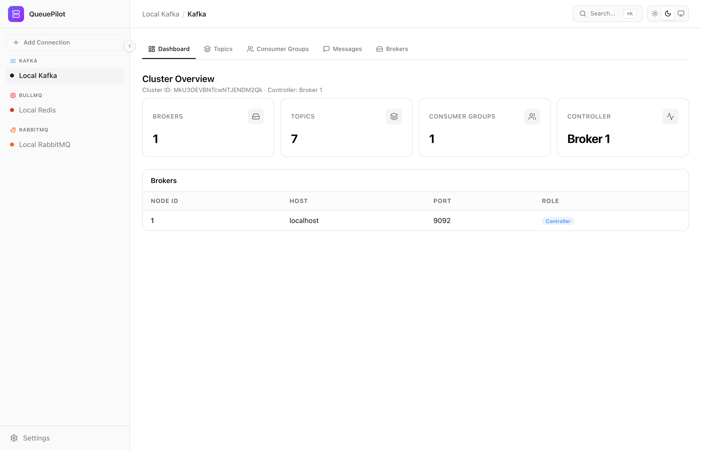

### Kafka Topic Detail -- Partitions
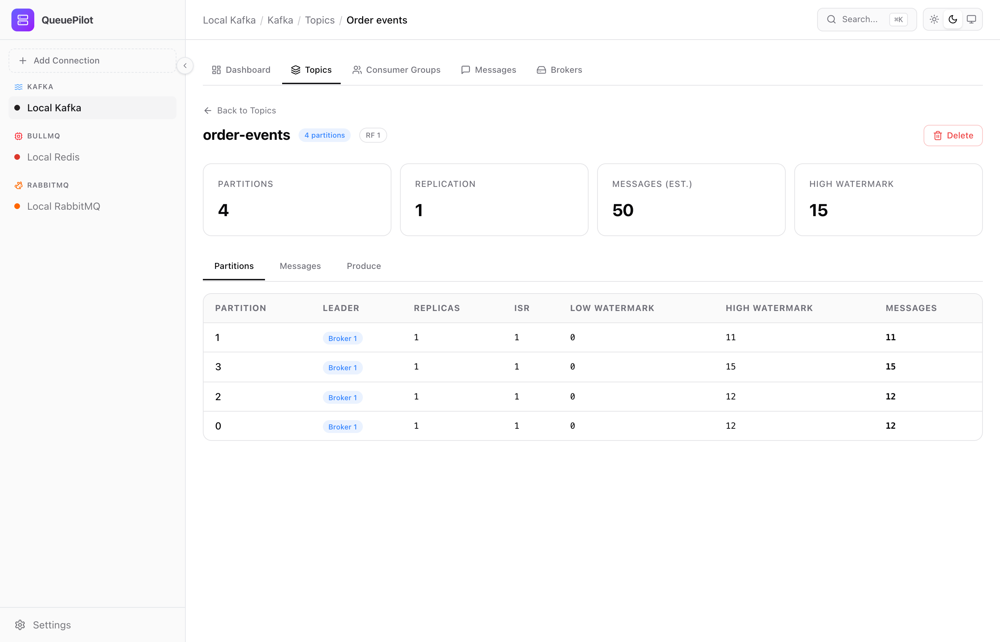

### Kafka Topic Messages
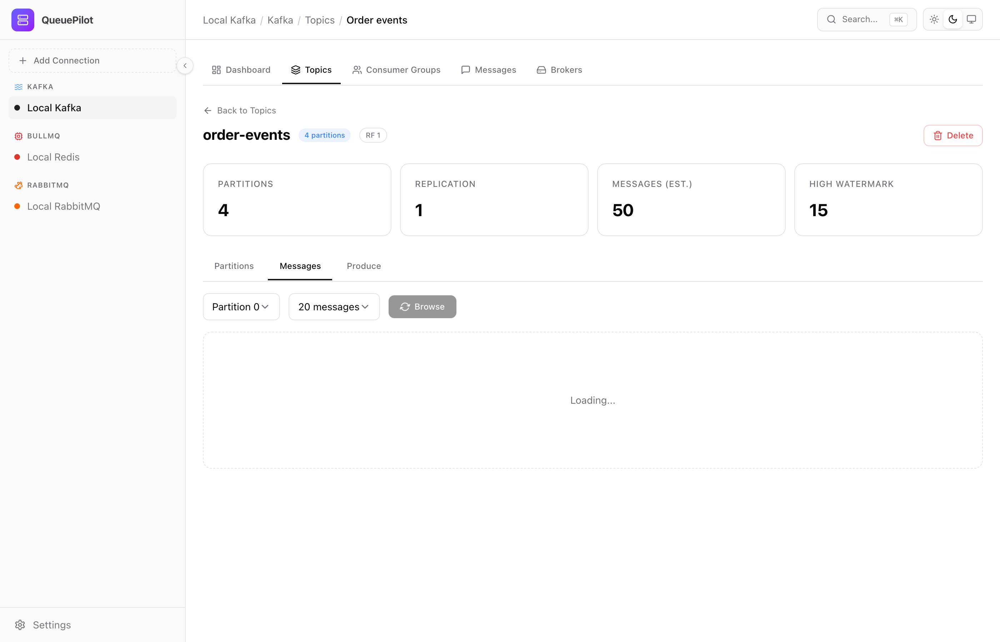

### BullMQ Dashboard
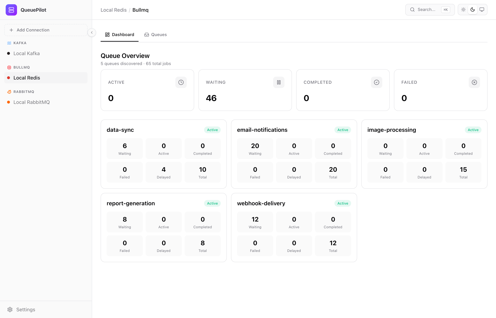

### BullMQ Queue Detail -- Job Browser
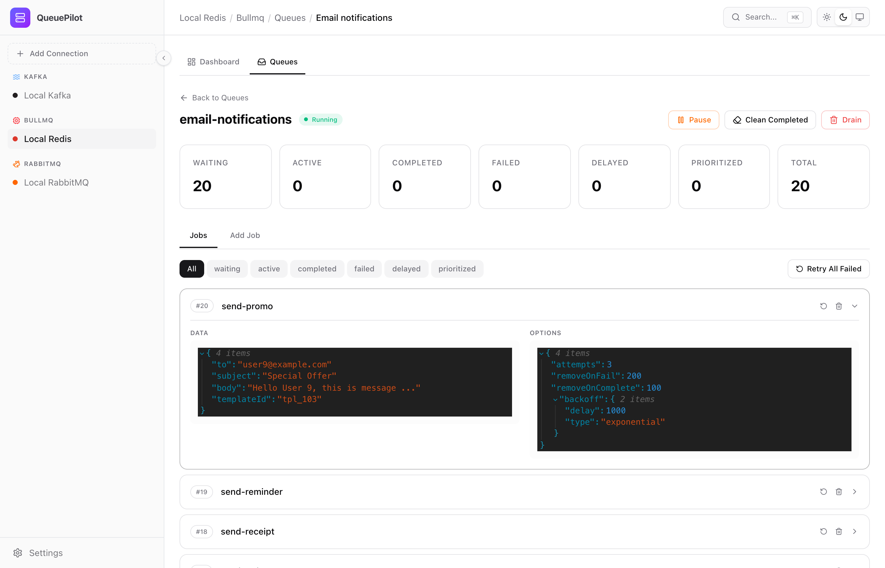

### New Connection
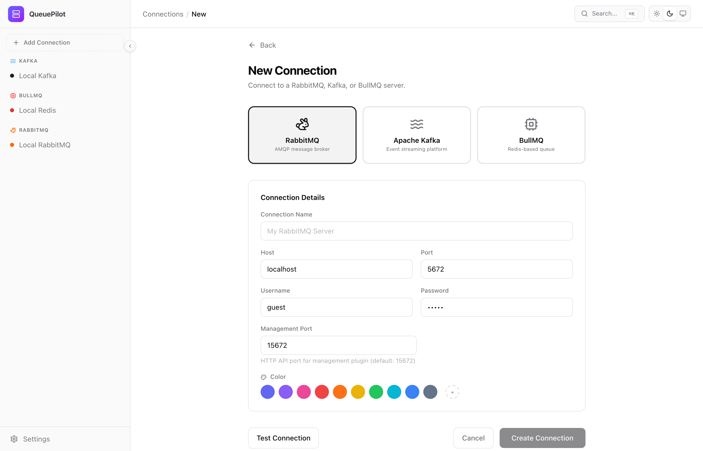

## Features

### Multi-Server Connection Management
Register and switch between multiple server connections (like pgAdmin). Each connection is stored locally with AES-256-GCM encrypted credentials. Color-coded sidebar grouped by broker type.

### RabbitMQ (Full Feature Parity with Management Plugin)
- **Dashboard** -- Cluster overview, node health, memory/disk alarms, real-time message rate charts (publish/deliver/ack), queue depth
- **Exchanges** -- Full CRUD, binding management, publish messages with JSON/Text editor (format, minify, validate)
- **Queues** -- Full CRUD, purge, message browsing with JSON viewer, consume with ack modes (ack/nack/reject + requeue), download messages as gzip
- **Queue Detail** -- Dedicated page with overview, messages tab, publish tab, bindings tab
- **Bindings** -- Visual binding management (exchange-to-queue, exchange-to-exchange)
- **Connections & Channels** -- Live connection list, close connections, channel details with prefetch/consumer counts
- **Virtual Hosts** -- CRUD with deletion protection
- **Users** -- CRUD, role/tag assignment (administrator/management/monitoring/policymaker), per-vhost regex permissions
- **Policies** -- Pattern-based policy editor (DLX, TTL, max-length, alternate exchange, HA mode)
- **Definitions** -- Full import/export with drag-and-drop file upload, preview before import

### Apache Kafka
- **Dashboard** -- Cluster overview, broker list with controller indicator, topic/partition/consumer group counts
- **Topics** -- Full CRUD, partition details (leader, replicas, ISR, watermarks, message counts)
- **Topic Detail** -- Partitions tab, message browser by partition, produce messages with JSON/Text editor
- **Consumer Groups** -- Group list with state/protocol/member count, offset management
- **Message Browser** -- Browse by partition + offset, JSON viewer with headers
- **Message Producer** -- Produce with key/value/headers/partition selection, JSON validation
- **Brokers** -- Broker list with host/port/rack/controller role

### BullMQ
- **Dashboard** -- Queue overview cards with job counts per state, total jobs
- **Queues** -- List with per-state breakdown (waiting/active/completed/failed/delayed/prioritized)
- **Queue Detail** -- Pause/resume, clean by state, drain, add job with JSON editor
- **Job Browser** -- Filter by state, inline job detail with data/options/stacktrace/return value
- **Job Actions** -- Retry, remove, promote (delayed to waiting), retry all failed, bulk clean

### Cross-Cutting
- **Global Search** -- `Cmd+K` / `Ctrl+K` to search across all connections
- **Dark/Light Theme** -- System-aware with manual toggle
- **JSON Viewer** -- Syntax highlighting, collapsible nodes, search, copy
- **Message Editor** -- Dual-mode editor (JSON with line numbers + validation, or plain text), format/minify/copy/expand
- **Custom Dropdowns** -- Fully styled select components (no native elements)
- **Confirm Dialogs** -- Radix UI AlertDialog for all destructive operations
- **Data Export** -- CSV export from any data table
- **Favorites** -- Bookmark frequently accessed resources
- **Activity Log** -- Audit trail for destructive operations (purge, delete, offset reset)
- **Real-time Updates** -- Server-Sent Events push live metric updates
- **File Upload** -- Drag-and-drop with file preview for definitions import

## Tech Stack

| Layer | Technology |
|-------|-----------|
| Frontend | React 19, Vite, TypeScript, Tailwind CSS, shadcn/ui |
| Components | Radix UI primitives, custom Select/Switch/Dialog/Badge |
| State | TanStack Query (server), Zustand (client) |
| Charts | Apache ECharts |
| JSON Viewer | @uiw/react-json-view |
| Backend | NestJS, TypeScript |
| Database | SQLite (Drizzle ORM) |
| Real-time | Server-Sent Events (SSE) |
| Monorepo | pnpm workspaces |

## Quick Start

### Docker (Recommended)

```bash
docker run -d \
  --name queuepilot \
  -p 3000:3000 \
  -v queuepilot-data:/app/data \
  kianfar/queuepilot:latest
```

Open `http://localhost:3000` and add your first connection.

### Docker with Authentication

```bash
docker run -d \
  --name queuepilot \
  -p 3000:3000 \
  -e AUTH_USERNAME=admin \
  -e AUTH_PASSWORD=changeme \
  -v queuepilot-data:/app/data \
  kianfar/queuepilot:latest
```

### Docker Compose

```yaml
services:
  queuepilot:
    image: kianfar/queuepilot:latest
    ports:
      - "3000:3000"
    environment:
      - DATABASE_PATH=/app/data/queuepilot.db
      # - AUTH_USERNAME=admin
      # - AUTH_PASSWORD=changeme
    volumes:
      - queuepilot-data:/app/data

volumes:
  queuepilot-data:
```

### Development

```bash
# Clone
git clone https://github.com/navid-kianfar/queuepilot.git
cd queuepilot

# Install dependencies
pnpm install

# Build shared packages
pnpm --filter @queuepilot/shared build

# Start dev servers (frontend + backend)
pnpm dev
```

Frontend: `http://localhost:5173` | API: `http://localhost:3000`

### Development with Local Brokers

```bash
# Start RabbitMQ, Kafka, and Redis locally
docker compose -f docker-compose.dev.yml up -d

# Seed with demo data
npx tsx scripts/seed.ts

# Start QueuePilot
pnpm dev
```

### Build from Source

```bash
pnpm build
pnpm start
```

## Environment Variables

| Variable | Description | Default |
|----------|-------------|---------|
| `PORT` | Server port | `3000` |
| `DATABASE_PATH` | SQLite database file path | `./queuepilot.db` |
| `AUTH_USERNAME` | Enable basic auth (set both username + password) | _(disabled)_ |
| `AUTH_PASSWORD` | Enable basic auth (set both username + password) | _(disabled)_ |
| `ENCRYPTION_KEY` | 64-char hex string for credential encryption | _(auto-generated)_ |

## Architecture

```
queue-manager/
  apps/
    api/          # NestJS backend (proxy to broker APIs)
    web/          # Vite + React frontend
  packages/
    shared/       # Shared types, enums, DTOs, constants
```

### How it connects to your brokers

- **RabbitMQ**: Proxies to the Management HTTP API (port 15672). No AMQP connection needed.
- **Kafka**: Uses `kafkajs` for admin operations and ephemeral consumers for message browsing.
- **BullMQ**: Connects to Redis via the `bullmq` library to manage queues and jobs.

All credentials are encrypted at rest using AES-256-GCM. The encryption key is stored as an environment variable, never in the database.

### Production Deployment

A single Docker container serves both the NestJS API and the built React frontend on one port. No reverse proxy needed for basic deployments.

## Contributing

Contributions are welcome! This project uses:

- **pnpm** for package management
- **TypeScript** throughout (shared types between frontend and backend)
- **NestJS modules** for backend features (one module per broker type)
- **React Query** for server state, **Zustand** for UI state only
- **shadcn/ui patterns** for all UI components (Radix primitives + Tailwind)

## License

MIT
